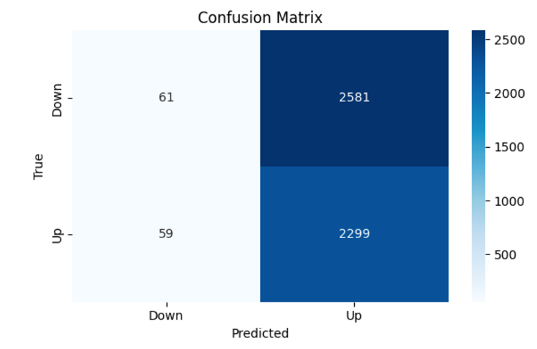

# First Year Innovation & Research Experience at UMD: Quantum ML Research

## Quantum-Enhanced Forecasting: Leveraging Quantum Gramian Angular Field (QGAF) and CNNs for Stock Return Predictions

### Table of Contents

1. [Introduction](#introduction)
2. [Methods](#methods)
   - [Quantum Circuit Design](#quantum-circuit-design)
   - [QGAF Transformation](#qgaf-transformation)
3. [Dataset and Preprocessing](#dataset-and-preprocessing)
   - [Preprocessing Steps](#preprocessing-steps)
   - [Visualization](#visualization)
4. [Results](#results)
   - [Key Performance Metrics](#key-performance-metrics)
   - [Confusion Matrix](#confusion-matrix)
   - [Insights](#insights)
5. [Conclusion](#conclusion)
   - [Broader Impact](#broader-impact)
   - [Future Directions](#future-directions)
6. [References](#references)

---

### Introduction

Predicting stock price movements is a complex challenge faced by many traders and analysts. Our research leverages **Quantum Gramian Angular Field (QGAF)** transformations combined with **Convolutional Neural Networks (CNNs)** to classify stock price trends as "up" or "down." By transforming 1D time-series stock data into 2D images, we enable CNNs to extract features more effectively, showcasing the potential of quantum machine learning in financial forecasting.

---

### Methods

We utilized **Qiskit**, IBM's open-source quantum computing framework, to develop and simulate quantum circuits. Below is a high-level overview of the methodology:

1. **Quantum Circuit Design**:
   - Two rotational gates compute trigonometric transformations, approximating `cos(a+b)` and `sin(a-b)`.
   - These transformations extract angular relationships in the stock time-series data.
   - Averaging results from multiple circuit runs enhances calculation accuracy.

   

2. **QGAF Transformation**:
   - Time-series stock price segments are passed through the quantum circuits.
   - Pixel intensities in the resulting images represent relationships in the data.

This process generates QGAF images, which are subsequently used as input for the CNN model.

---

### Dataset and Preprocessing

The dataset is constructed using QGAF transformations applied to stock price data sourced from **Yahoo Finance**. Key details include:

- **Stocks Covered**: 20 tickers, including Apple and other financial instruments.
- **Dataset Size**: ~75,000 QGAF images (18,700 samples with 4 images per sample).
- **Features**: Moving averages, Bollinger Bands.
- **Segmentation**: Time series data is divided into overlapping 50-day segments with a step size of 1 day.

#### Preprocessing Steps:
- **Cleaning**: Removed missing or anomalous data points.
- **Normalization**: Standardized data via feature scaling.
- **Transformation**: Converted financial indicators into QGASF and QGADF matrices using quantum circuits.

#### Visualization:

---

### Results

Simulations were conducted using Qiskit’s simulator backend to generate QGAF images.

#### Key Performance Metrics:
- **Training Accuracy**: 70%
- **Validation Accuracy**: 47%
- **Test Accuracy**: 69%
- **Precision**: 71%
- **Recall**: 68%
- **F1-Score**: 69%

#### Confusion Matrix:

#### Insights:
While the model demonstrates strong training and test performance, the validation accuracy highlights overfitting, emphasizing the need for a larger dataset or further tuning. The results validate the potential of QGAF transformations but suggest room for improvement with real-world quantum hardware.

---

### Conclusion

We successfully developed a multi-input CNN model enhanced with QGAF images to predict stock price movements.

#### Broader Impact:
- Demonstrates the potential of quantum machine learning for financial forecasting.
- Highlights the ability of QGAFs to encode nuanced market dynamics for CNN classification.

#### Future Directions:
- Expand the dataset with more stocks and a broader date range.
- Transition from simulations to real Quantum Processing Units (e.g., **IONQ**).
- Explore advanced architectures, such as pre-trained models (e.g., ResNet, EfficientNet) or hybrid quantum-classical models (e.g., QCNN).

Learn more about the First Year Innovation & Research Experience: https://www.fire.umd.edu/qml

---

### References

- Devlin, J., Chang, M.-W., Lee, K., & Toutanova, K. (2018). BERT: Pre-training of deep bidirectional transformers for language understanding. *arXiv*. <https://arxiv.org/abs/1810.03787>
- Kingma, D. P., & Ba, J. (2015). Adam: A method for stochastic optimization. *arXiv*. <https://arxiv.org/abs/1506.00327>
- LurreMcFly. (n.d.). ERP prediction contest. *GitHub*. <https://github.com/LurreMcFly/erp_prediction_contest/tree/master>
- Schwab. (n.d.). Bollinger Bands®: What they are and how to use them. *Charles Schwab*. <https://www.schwab.com/learn/story/bollinger-bands-what-they-are-and-how-to-use-them>
- Spall, J. C. (1998). An overview of the simultaneous perturbation method for efficient optimization. *Johns Hopkins University Applied Physics Laboratory*. <https://www.jhuapl.edu/SPSA/PDF-SPSA/Spall_An_Overview.PDF>
- Tao, J., Chen, W., Gou, Z., & Zhang, Y. (2023). Quantum-enhanced forecasting for financial market prediction. *arXiv*. <https://arxiv.org/abs/2310.07427>
