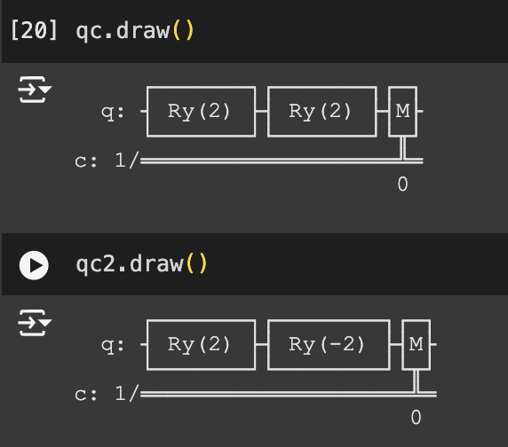
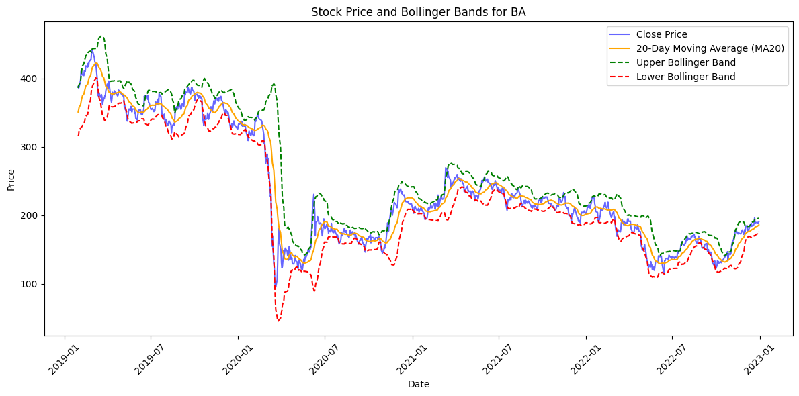

# Quantum-ML-Research

## Quantum-Enhanced Forecasting: Leveraging Quantum Gramian Angular Field And CNNs for Stock Return Predictions

### Introduction

Our motivation is to address the problem that many face with determining which stocks to buy and sell.

We intend to leverage the Quantum Gramian Angular Field and implement image classification with CNN. The CNN will be trained with a select few stocks and should output an up-down classification of any given stock

The quantum advantage is to efficiently turn a 1-dimensional time series into a 2-dimensional image. It’s suitable because a 2-D image has features for CNN classification.

### Methods

We utilized Qiskit, IBM's open-source quantum computing framework, for developing and simulating quantum circuits. The diagram is as follows:

After retrieving time series data from specific stocks, the data is fed into the quantum circuit, where two rotational gates are applied to try and assume the same effect as calculating cos(a+b) for the first circuit, and sin(a-b) for the second. The computed trigonometric functions provide insights into the angular relationships within the data, which are then translated into pixel intensities to construct the QGAF images. By running these circuits multiple times and averaging the results, we can improve the accuracy of our calculations. These circuits help to identify relationships in time series data and are essential in creating QGAF images.

### Dataset and Preprocessing

The dataset is generated using Quantum Gramian Angular Field (QGAF) transformations applied to stock price data. The stock data is sourced from Yahoo Finance. Currently, we are using 20 stocks. The size is approximately 75,000 QGAF images (18,700 samples with 4 images each). Time-series stock price data are broken into segments. These segments’ vector representations are fed into quantum circuits that generate QGAF images. The features include the moving average and bollinger bands. Our CNN implements both features simultaneously for the interest of producing more refined results.

The data is cleaned by removing missing or anomalous data points to ensure data integrity. We divided time series data into overlapping segments of 50 days with a window step of 1 day. Normalization was done by applying feature scaling to standardize the range of input data. We converted financial indicators into QGASF and QGADF matrices using quantum circuits, then visualized as images.

Visualization:

### Results

The simulations are conducted using Qiskit's simulator backend to generate QGAF images. 

Our model achieved an accuracy rating of XX% and a validation accuracy of XX%. On top of that, we observed a consistent decrease in training and validation loss over epochs, indicating effective learning. We also ensured the dataset was balanced between up and down labels. 

Here are some other performance metrics:
The training accuracy is XX
The validation accuracy is XX
The testing accuracy is XX
The precision is XX
The recall is XX
The F1-score is XX
The confusion matrix is XX

### Conclusion

In summary, we successfully developed a multi-input CNN model enhanced with QGAF images to predict stock price movements.

The broader impact of our work demonstrates the potential of quantum machine learning in financial forecasting, offering a novel approach to handling complex market data. The use of QGAFS provides distinctive representations that can provide powerful insights as quantum hardware improves over time.

We have numerous ideas that could act as potential improvements or extensions to our research. Because it is a multi-input CNN, we intend to incorporate more tickers and extend the date range to enhance model robustness. We should transition from simulation to actual Quantum Processing Units to evaluate real-world performance gains. This could potentially be done on a local quantum computer such as IONQ. Another approach is to experiment with more sophisticated neural network architectures and hybrid quantum-classical models. This could include a QCNN or a pre-trained model such as ResNet and EfficientNet for feature extraction. 

### References

Devlin, J., Chang, M.-W., Lee, K., & Toutanova, K. (2018). BERT: Pre-training of deep bidirectional transformers for language understanding. arXiv.
https://arxiv.org/abs/1810.03787

Kingma, D. P., & Ba, J. (2015). Adam: A method for stochastic optimization. arXiv. https://arxiv.org/abs/1506.00327

LurreMcFly. (n.d.). ERP prediction contest. GitHub. https://github.com/LurreMcFly/erp_prediction_contest/tree/master

Schwab. (n.d.). Bollinger Bands®: What they are and how to use them. Charles Schwab.
https://www.schwab.com/learn/story/bollinger-bands-what-they-are-and-how-to-use-them#:~:text=Bollinger%20Bands%C2%AE%20help%20you,potential%20entry%20and%20exit%20points

Spall, J. C. (1998). An overview of the simultaneous perturbation method for efficient optimization. Johns Hopkins University Applied Physics Laboratory. https://www.jhuapl.edu/SPSA/PDF-SPSA/Spall_An_Overview.PDF

Tao, J., Chen, W., Gou, Z., & Zhang, Y. (2023). Quantum-enhanced forecasting for financial market prediction. arXiv. https://arxiv.org/abs/2310.07427

